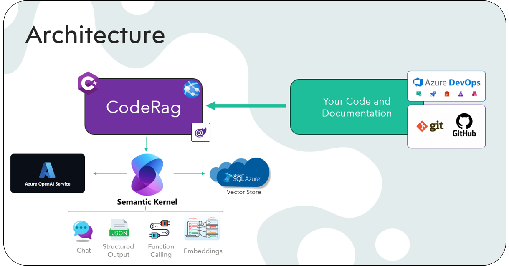

# CodeRag
An AI Expert for your C# Codebase

## Do your C# Code Repo have
- [ ] Inline Documentation (XML Summaries)?
- [ ]  External Documentation (Wiki)?
- [ ]  An expert who helps...
  - [ ]  with Usage (Internal/External)?
  - [ ]  with Reviews?

# What if we made AI help with filling the above boxes? 😎

CodeRag is an AI Solution that parses your C# Code Repo + existing documentation you may have; add it to a VectorStore (RAG) and offer you (and users/colleagues) an AI solution to help better understand the code, help with documentation, and even Code Reviews

## Public or Private
``PUBLIC`` CodeRag offers any GitHub public repos to be indexed, with the Owner getting access to tweak settings.

``PRIVATE`` For Private Repos, you can clone this Repo and self-host for code-security (Require an Azure OpenAI Resource, an Azure SQL Database and a GitHub Account)

## Features

### Frontend
- AI Chat Experience to learn the Codebase

### Admin Backend Workbench.
- Parsing/Ingestion of C# Code into SQL Azure VectorStore
- XML Summary Generation/Maintenance
- Markdown Documentation Generation
- GitHub Pull Request Reviews

### (Additional Planned Features)
- GitHub WebHook Integration for automated PR Reviews on creation/sync
- API Access for automation of ingestion
- MCP Support

## Architecture



## Setup
In order to clone and run this repo locally you will need the following Azure Resources
- An Azure OpenAI Service Resource ([How to Guide for setup](Guides/HowToCreateAnAzureOpenAiServiceResourceInAzure.md))
- An Azure SQL Database (for VectorStore)
- An GitHub Account with a configured Fine Grained Token

### Configuration Variables
Based on the 3 above Resources you need the following configuration variables

| Configuration Key | Sensitive Information | Instructions |
| --- | --- | --- |
| AiEndpoint | No | Normally defined in appsettings.json |
| AiKey | Yes | Defined in secrets.json |
| AiEmbeddingDeploymentName | No | Normally defined in appsettings.json |
| AiModelDeployments | No | Normally defined in appsettings.json |
| SqlServerConnectionString | Yes | Defined in secrets.json |
| GitHubToken | Yes | Defined in secrets.json |

### Sample appsettings.json
```js
{
  "Logging": {
    "LogLevel": {
      "Default": "Information",
      "Microsoft.AspNetCore": "Warning"
    }
  },
  "AllowedHosts": "*",
  "AiEndpoint": "https://myService.openai.azure.com/", //Your Azure OpenAI Endpoint
  "AiEmbeddingDeploymentName": "text-embedding-3-small", //Your name of you EmbeddingModel deployed in Azure OpenAI
  "AiModelDeployments": [ //One or more ChatModelDeployments
    {
      "DeploymentName": "gpt-4.1-mini", //Name of Deployment
      "Temperature": 0 //Temp to use (0 - 2; lower value is recommended)
    },
    {
      "DeploymentName": "gpt-4.1",
      "Temperature": 0
    },
    {
      "DeploymentName": "o3-mini",
      "ReasoningEffortLevel": "high", //For Reasoning Models you can define low/medium/high for reasoning effort
      "TimeoutInSeconds": 300 //As reasoning models tend to 'think' longer a higher timeout is normally needed
    }
  ]
}
```

### Sample secrets.json
```js
{
  "AiKey": "1234567890abcdefg", //Your Azure OpenAI Service Key
  "SqlServerConnectionString": "Server=tcp:myserver.database.windows.net,1433;Initial Catalog=myDb;Persist Security Info=False;User ID=myuser;Password=myPW;", //Your SQL Server ConnectionString
  "GitHubToken": "github_pat_1234567890abcdefg" //Your GitHubToken
}
```
- See https://learn.microsoft.com/en-us/aspnet/core/security/app-secrets on how to work with user-secrets